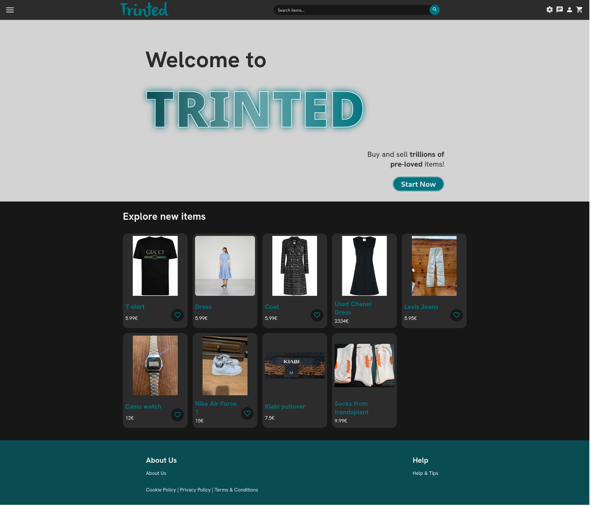
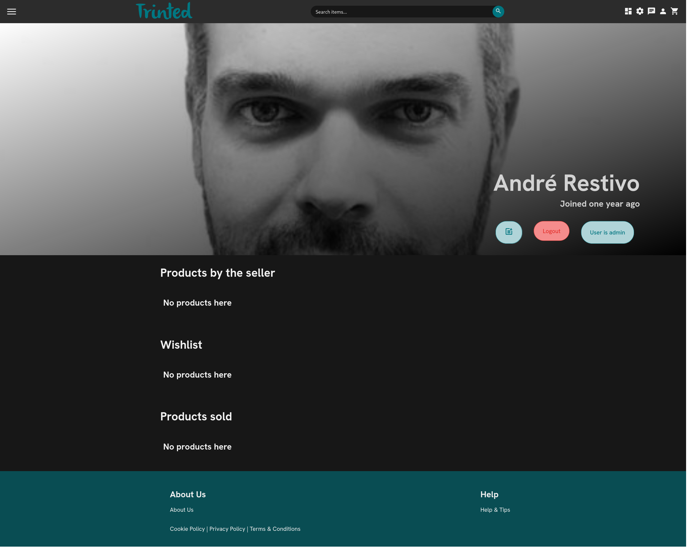
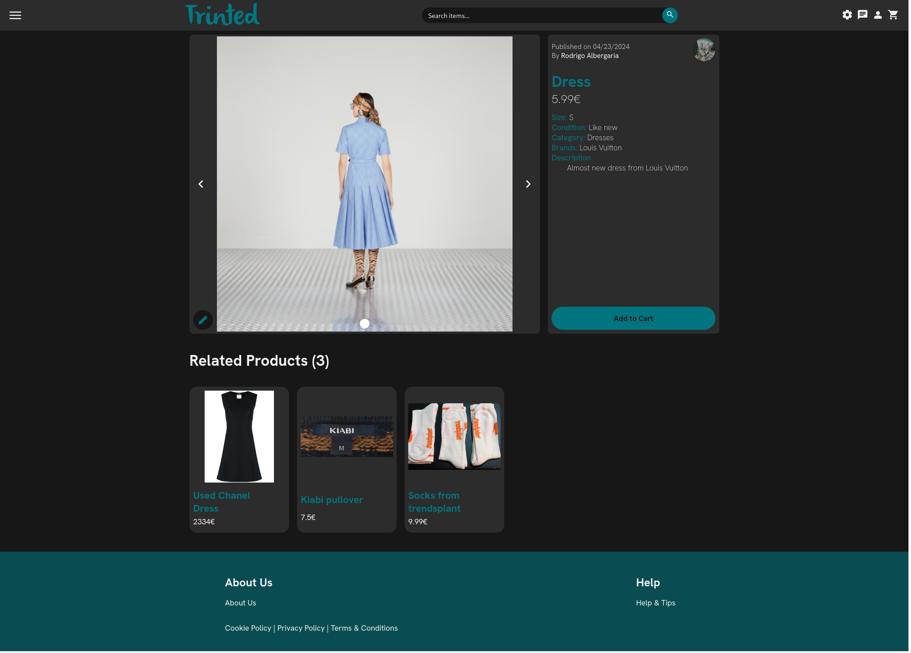
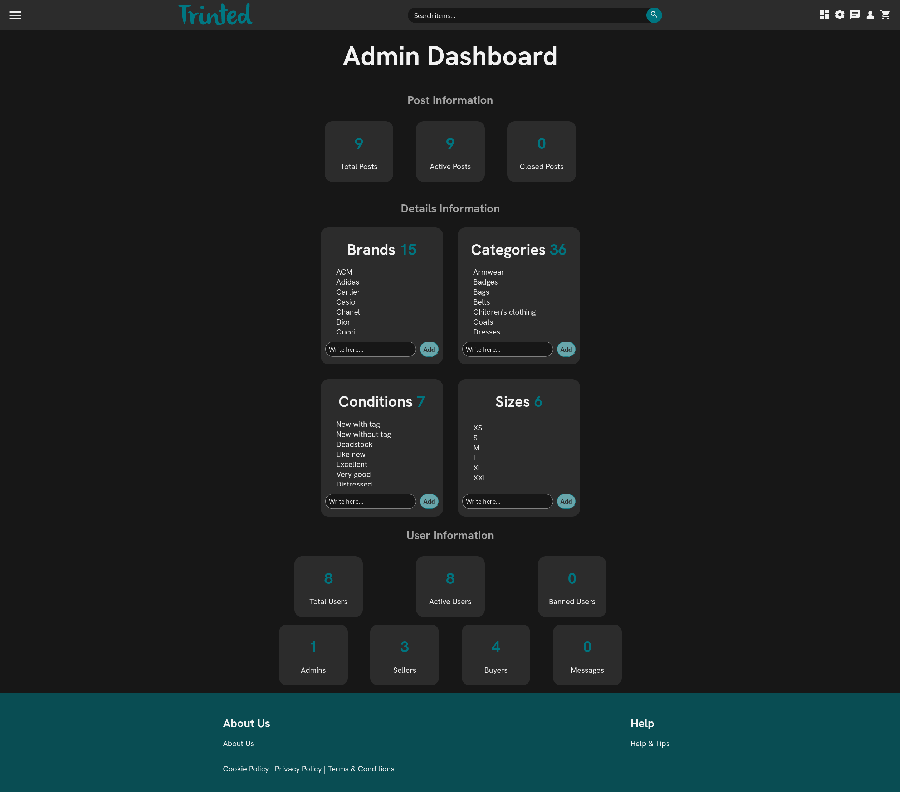
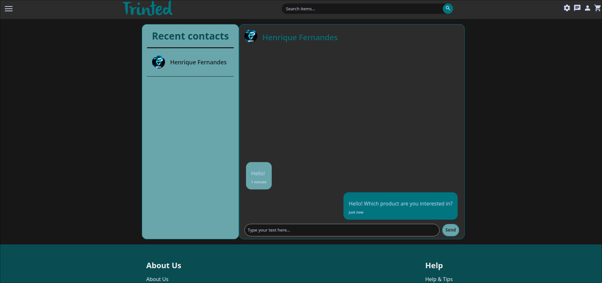

<h1 align="center"> Trinted </h1>

## Group ltw15g02

- Bruno Ricardo Soares Pereira de Sousa Oliveira (up202208700) 33%
- Henrique Sardo Fernandes (up202204988) 33%
- Rodrigo Albergaria Coelho e Silva (up202205188) 33%

## Install Instructions

#### Cloning the project

```sh
git clone https://github.com/FEUP-LTW-2024/ltw-project-2024-ltw15g02
git checkout final-delivery-v1
```

#### Running the project (without script)

```sh
sqlite3 db/database.db < db/create.sql
sqlite3 db/database.db < db/populate.sql
tsc
php -S localhost:9000 &
xdg-open localhost:9000
```

#### Running the project (with script)

```sh
./run.sh
```

## External Libraries

We have used the following external libraries:

- php-gd

## Screenshots








## Implemented Features

**General**:

- [X] Register a new account.
- [X] Log in and out.
- [X] Edit their profile, including their name, username, password, and email.

**Sellers**  should be able to:

- [X] List new items, providing details such as category, brand, model, size, and condition, along with images.
- [X] Track and manage their listed items.
- [X] Respond to inquiries from buyers regarding their items and add further information if needed.
- [X] Print shipping forms for items that have been sold.

**Buyers**  should be able to:

- [X] Browse items using filters like category, price, and condition.
- [X] Engage with sellers to ask questions or negotiate prices.
- [X] Add items to a wishlist or shopping cart.
- [X] Proceed to checkout with their shopping cart (simulate payment process).

**Admins**  should be able to:

- [X] Elevate a user to admin status.
- [X] Introduce new item categories, sizes, conditions, and other pertinent entities.
- [X] Oversee and ensure the smooth operation of the entire system.

**Security**:

We have been careful with the following security aspects:

- [X] **SQL injection**
- [X] **Cross-Site Scripting (XSS)**
- [X] **Cross-Site Request Forgery (CSRF)**

**Password Storage Mechanism**: PHP **password_hash** and **password_verify**

**Aditional Requirements**:

We also implemented the following additional requirements:

- [X] **PHP Framework**
- [X] **REST API Integration**
- [X] **Real-Time Messaging System**
- [X] **User Preferences**
- [X] **Analytics Dashboard**
- [X] **Shipping Costs**

---

## Tips and Tricks (for anyone doing a similar project)

- At the beginning of the project, do not speedrun the website mockup creation, and make the mockups as close to the final product as possible. This will really help the website creation to be more streamlined and avoid further surprises down the line. On the same note, think well of the features you want to implement right at the start.
- Try to make the design as similar between the pages as possible. Reusing components between the different pages really helps with this. This will allow you to have much cleaner code (especially CSS code) and a more consistent interface. The use of differently-looking buttons, inputs and such was one of the reasons this project was penalized.
- We were also penalized for "overmixing" PHP business logic code with HTML code. We should have created the database connection in one place (in the page function, for example), extracted all the needed information and passed it to the rest of the functions, while separating the code related to database communication with the code responsible for the HTML output.
- I recommend creating a framework, like we did, as it simplifies a lot of "simple" repetitive things you need to do and also allows you to do some niche stuff (like setting personalized routes, without relying on the project folder structure). I also recommend creating a REST API, as it allows data interchange with the server in a much cleaner way than with actions. The API we created also follows the HATEOAS principle.

## Results

Final Grade: 18.6/20